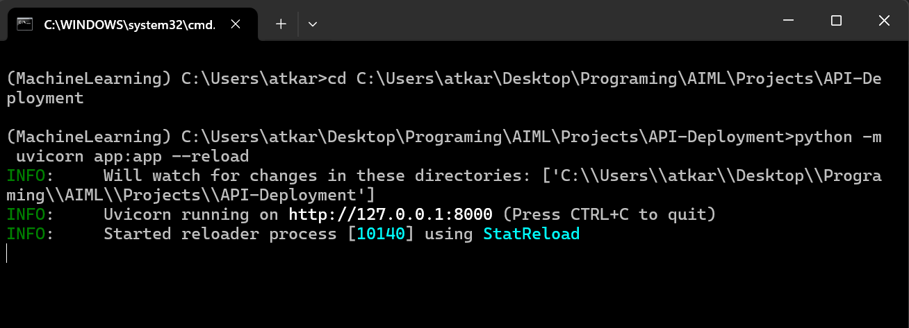
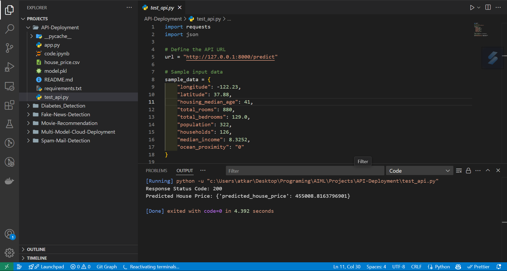

# House Price Prediction API

This project provides a machine learning model to predict house prices based on various features like location, median income, number of rooms, and proximity to the ocean. It also cover model deployment using **FAST API**

---

## 1️⃣ Machine Learning Model Overview
### **Dataset Used**
- **California Housing Price Dataset**
- Features include:
  - `longitude`, `latitude` (Location)
  - `housing_median_age` (Age of the house)
  - `total_rooms`, `total_bedrooms`, `population`, `households` (Housing details)
  - `median_income` (Income level)
  - `ocean_proximity` (Encoded categorical feature)

### **Model Training Process**
- **Preprocessing**: One-hot encoding for categorical variables.
- **Algorithm Used**: Linear Regression, Random Forest.
- **Data Split**: Train-Test Split (80-20).
- **Serialization**: The trained model is saved as `model.pkl`.

---

## 2️⃣ Setup and Deployment Steps

### **Step 1: Install Dependencies**
```bash
pip install -r requirements.txt
```

### **Step 3: Start FastAPI Server**

```bash
pythom -m uvicorn app:app --reload
```
- The API will be available at `http://127.0.0.1:8000`
- API Docs: `http://127.0.0.1:8000/docs`




---

## 3️⃣ How to Test the API

Run `test_api.py` to send a test request:
```bash
python test_api.py
```



---

