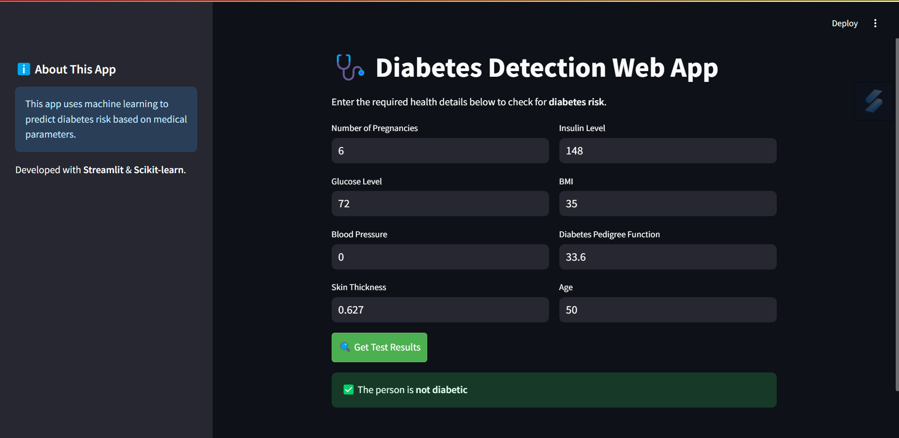

# 🩺 Diabetes Detection using Ensemble Learning  

This project builds a **Diabetes Detection Model** using **Ensemble Learning**, combining multiple classifiers (**SVM, Decision Tree, and K-Nearest Neighbors (KNN)**) for better accuracy and reliability.  

To make this model accessible, we created a **web interface using Streamlit**, where users can input their medical details and get instant predictions.

---

## 🚀 Project Overview  

✅ **Machine Learning Model**  
- **Ensemble Learning** using **SVM, Decision Tree, and KNN**  
- Dataset: **PIMA Indian Diabetes Dataset**  
- Features: Pregnancies, Glucose, Blood Pressure, Skin Thickness, Insulin, BMI, Diabetes Pedigree Function, Age  
- **Model Storage**: Saved using `pickle`  

✅ **Web Interface**  
- Built using **Streamlit** for easy interaction  
- Users enter health parameters to get diabetes predictions  
- Lightweight and runs in a web browser  

---

## 🌐 **Run the Web App**  
After training, launch the **Streamlit web app** to interact with the model:  
```bash
streamlit run app.py
```

This will open a browser where you can enter medical parameters and get predictions.

---

## 🧠 **How the Model Works**  

1. **Data Preprocessing**  
   - Handle missing values  
   - Feature scaling using `StandardScaler`  

2. **Ensemble Model Training**  
   - **SVM (Support Vector Machine)**  
   - **Decision Tree** for handling non-linear patterns  
   - **K-Nearest Neighbors (KNN)** for instance-based learning  
   - **Voting Classifier** used to combine predictions from all models  

3. **Model Evaluation**  
   - Accuracy: **~75% - 80%**  
   - Precision, Recall, F1-score calculated using `classification_report`  

---

## 📌 **Screenshots**  

**Web Interface (Streamlit):**  
  

**Model Training Output:**  
```
Accuracy: 80.51%

Confusion Matrix:
    [[88, 14]]
    [[16, 36]]
```

---